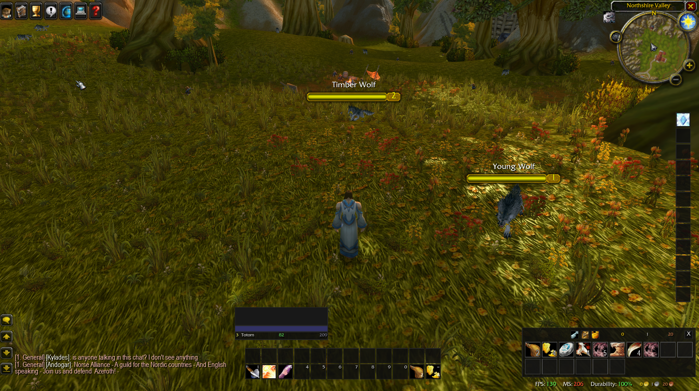
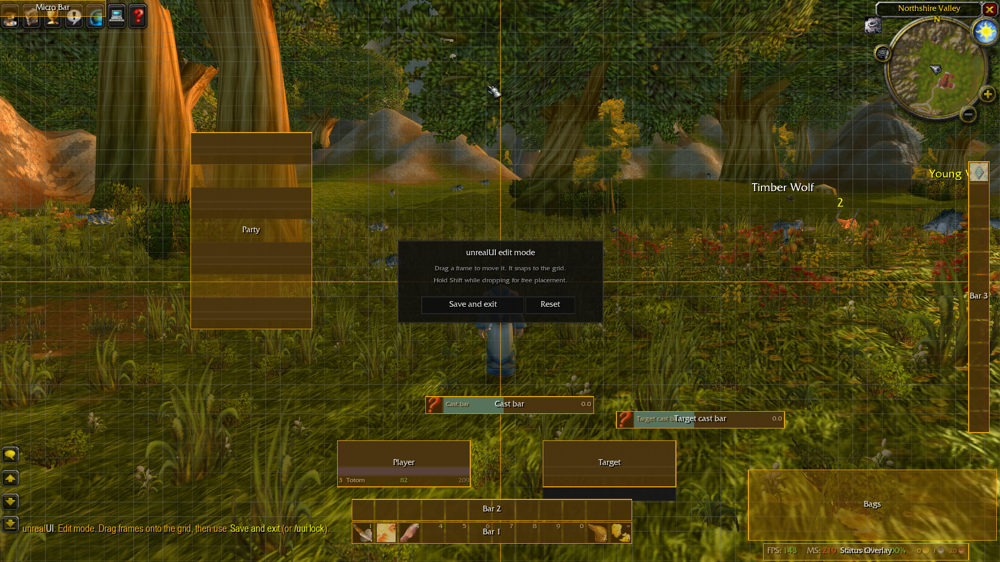
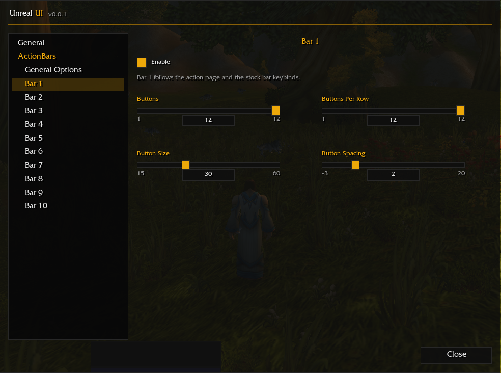
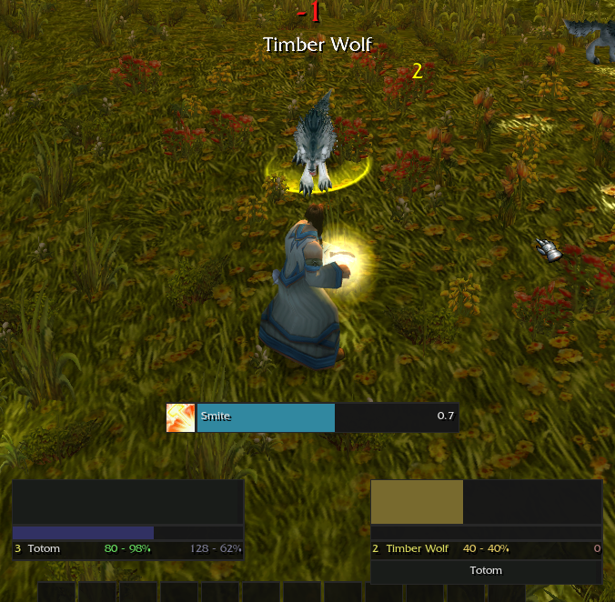
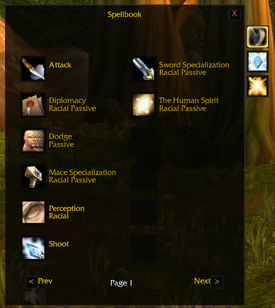
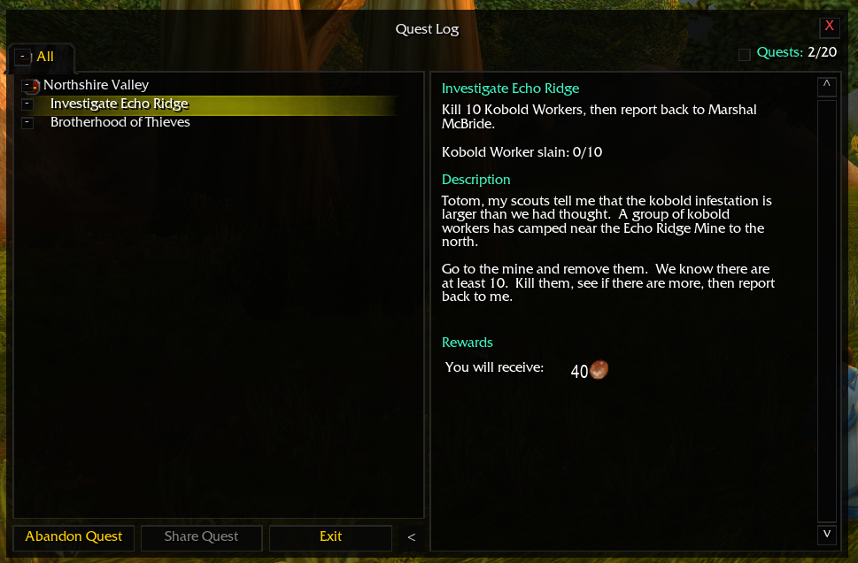

# UnrealUI

**A cleaner, sharper and fully personal interface for Unreal Azeroth.**

> [!IMPORTANT]
> ## Install UnrealUI
> 1. [Download the latest release](https://github.com/Tom75VN/UnrealUI/releases/latest/download/UnrealUI.zip).
> 2. Extract the archive into `Azeroth\Interface\AddOns\`.
> 3. Rename the extracted `unrealUI-master` folder to `unrealUI` by removing `-master`.
> 4. Confirm that `unrealUI.toc` is directly inside the `unrealUI` folder, then launch the game or reload the interface.

UnrealUI modernizes the information you use every minute while preserving the soul of the original game. Version **0.0.1** is built specifically for Unreal Azeroth / Emberveil.

## Main benefits

- Clean unit frames, nameplates, cast bar and at-a-glance performance status.
- Move supported UI overlays exactly where you want them with a visual edit mode.
- Resize the chat window to fit your layout.
- Configure up to ten action bars: buttons, rows, size, spacing and labels.
- Manage everything from one unified bag window with keyring support and quick grey-item cleanup.
- Enjoy refreshed tooltips, Quest Log, Spellbook, Game Menu and a compact microbar.
- Keep the familiar native minimap and loot experience untouched.

## Make Azeroth feel like your Azeroth

Your interface should help you live the adventure instead of making you fight for space on your screen. UnrealUI removes visual noise, brings essential information into focus and lets every important element sit where it feels natural to you.

Whether you are questing through the world, reacting in the middle of combat or building the perfect action-bar layout, UnrealUI keeps what matters clear and close. The result is a calmer screen, faster decisions and a world that feels bigger because the interface finally gets out of your way.

Install UnrealUI, shape it around the way you play and rediscover Azeroth through an interface that feels unmistakably yours.

## Screenshots

### Build your perfect layout

### Configure ten action bars

### Read every cast at a glance

### Explore with cleaner native windows

Use `/uui` to open the settings and `/uui unlock` to arrange supported overlays.

## Version

Initial public release: **0.0.1**
