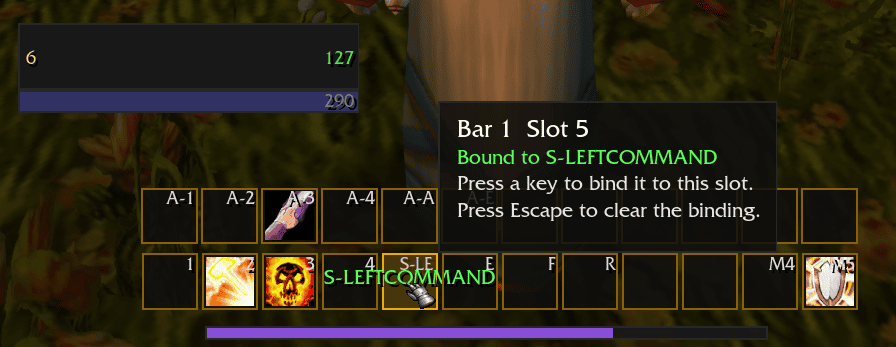
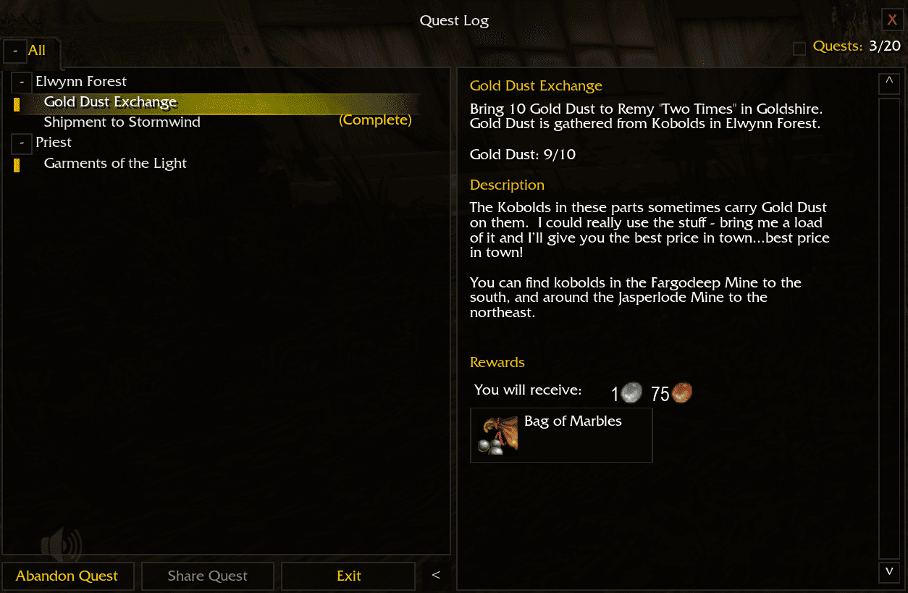
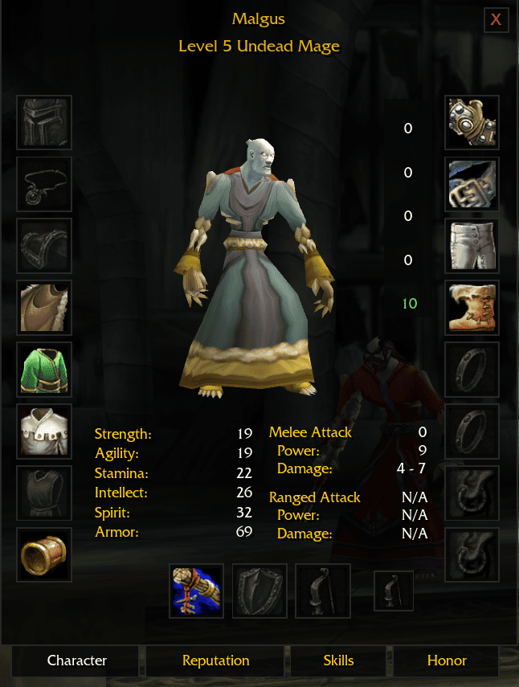

# UnrealUI

**Classic Azeroth, without fighting your interface.**

> [!IMPORTANT]
> ## Install UnrealUI
> 1. [Download the latest release](https://github.com/Tom75VN/UnrealUI/releases/latest/download/UnrealUI.zip).
> 2. Extract the archive into `Azeroth\Interface\AddOns\`.
> 3. Rename the extracted `unrealUI-master` folder to `unrealUI` by removing `-master`.
> 4. Confirm that `unrealUI.toc` is directly inside the `unrealUI` folder, then launch the game or reload the interface.

The original interface carries the soul of Vanilla, but it also makes you work for information that should be immediate. Important bars are scattered, key binding interrupts your flow, bags compete for space, and essential combat feedback can disappear into the screen.

UnrealUI keeps Azeroth familiar while removing that daily friction. It brings the information you act on closer together, gives every important element a clear place, and applies one sharp visual language across the interface. The result is a calmer screen, faster decisions, and more attention left for the world itself.

Built specifically for **Unreal Azeroth / Emberveil**.

## Why install UnrealUI?

### Your layout should follow your instincts

Move unit frames, action bars, bags, cast bars, XP and reputation bars, the quest tracker, status displays, the microbar, and other supported elements through one visual edit mode. Snap them cleanly to the grid or hold Shift for free placement, then keep the layout across reloads.

### Change bindings while you are still thinking about the ability

Quick Binding removes the trip through nested menus. Hover an action slot, press a key, and continue building your layout. Clear or replace bindings directly on the bars with immediate visual feedback.

### Read combat before the moment has passed

Clean player, target, target-of-target, pet, and party frames keep health and power readable at a glance. Modern nameplates emphasize your target, the player cast bar shows progress and remaining time, and configurable debuff rows separate Magic, Curse, Poison, Disease, and physical effects by color. The player and target frames each carry their buffs on a row of their own, and every aura icon runs the same radial wipe and countdown the action bars use. Two settings decide where your own auras appear: on the player frame, beside the minimap where the client draws them, either, or neither.

### Spend less time managing inventory

One unified bag window replaces the pile of separate containers. See item quality and cooldowns clearly, open the keyring when needed, and clean up grey items in one action—selling them at a merchant or asking before deleting them elsewhere.

The bank uses the same window: the bank container and every purchased bank bag are packed into one continuous grid, your bank bags sit in the header with the slot you have not bought yet, and item quality reads exactly as it does in your bags.

### Modern where it helps, familiar where it matters

The Quest Log, Character window, Spellbook, Social panels, merchants, trainers, quest dialogue, Game Menu, and other frequently used windows share the same compact modern style. The native minimap and loot experience remain familiar and untouched.

## See how UnrealUI improves the moment-to-moment experience

### 1. Shape the interface around the way you play

Stop adapting your attention to a fixed layout. Enter edit mode, see every supported element, and place information exactly where your eyes already expect to find it.

### 2. Bind abilities without leaving your bars

Hover a slot and press the key you want. Quick Binding turns a slow configuration chore into a direct, visual interaction.

### 3. Build action bars that match your playstyle

Configure up to ten action bars with control over button count, rows, size, spacing, backgrounds, labels, and cooldown information. Class form, stance, and stealth pages stay part of the same coherent system.

### 4. See every cast at a glance

Spell name, icon, progress, pushback, and remaining time stay together in a compact movable cast bar.

### 5. Follow quests without fighting the Quest Log

Clear sections, visible tracked quests, optional quest levels, persistent tracking after reload, and a collapsible detail panel make long questing sessions easier to navigate.

### 6. Understand your character on one clean screen

Equipment, attributes, resistances, reputation, skills, and honor use the same readable visual hierarchy instead of competing pieces of stock artwork.

### 7. Keep familiar systems, remove the visual noise

Core Vanilla windows such as the Spellbook retain their meaning and imagery while gaining cleaner spacing, sharper controls, and consistent navigation.

## Get started

Use `/uui` to open the settings, `/uui unlock` to arrange supported elements, and `/uui bind` to enter Quick Binding mode.

## Version

Current release: **0.3.1**

## Acknowledgements

[pfUI](https://github.com/shagu/pfUI) by Eric Mauser (Shagu) is used as a technical and design reference during UnrealUI development. pfUI is not bundled with UnrealUI.

## License

UnrealUI is distributed under the [MIT License](LICENSE).
